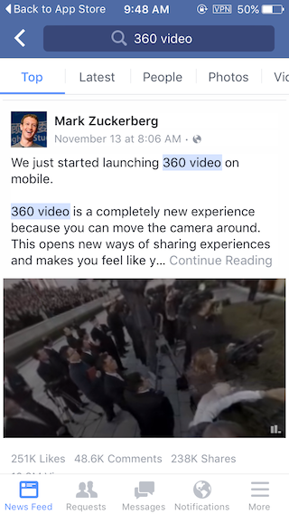
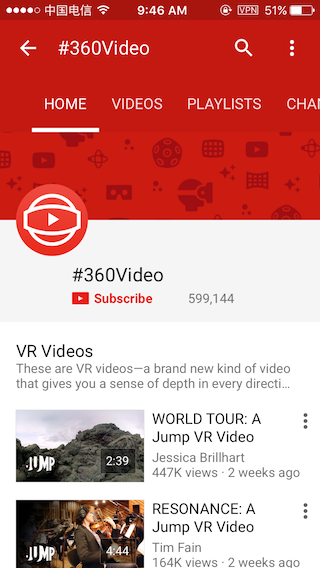
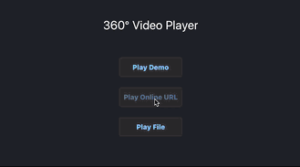
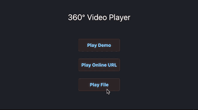

# 360 VR Player
### A Open Source, Ad-free, Native and Universal 360 dgree panorama video player for iOS. 

## About
#### HTY360Player is a 360 degree panorama video player for iOS.

## Motivation

#### Facebook has released a new function to play 360° video in its app.

#### Youtube App also has a 360° video channel.

## Features

* Play Online 360° Video

* Play Local 360° Video

## Todo
- Metal version.

## Contributing

1. Fork it
2. Create your feature branch (git checkout -b my-new-feature)
3. Commit your changes (git commit -am 'Add awesome feature')
4. Push to the branch (git push origin my-new-feature)
5. Create a new Pull Request

## Author
Hanton Yang, hanton.yang@gmail.com

## License
HTY360Player is available under the MIT license. See the LICENSE file for more info.
