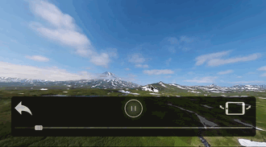

# Fisheye

A 360-degree panorama video player library for iOS.




## Features

- Play 360-degree panoramic videos
- Touch-based rotation for immersive viewing
- Easy-to-use `FisheyeView` API with SwiftUI support
- Configurable field of view, frame rate, and touch sensitivity
- Metal-based rendering for modern iOS devices
- Pure Swift implementation

## Requirements

- iOS 15.0+
- Swift 5.0+
- Xcode 14.0+

## Installation

### Swift Package Manager

Add Fisheye to your project using Swift Package Manager:

1. In Xcode, go to **File > Add Package Dependencies...**
2. Enter the repository URL: `https://github.com/user/Fisheye`
3. Select the version you want to use
4. Click **Add Package**

Or add it to your `Package.swift`:

```swift
dependencies: [
    .package(url: "https://github.com/user/Fisheye", from: "2.1.0")
]
```

## Usage

### SwiftUI

Fisheye provides first-class SwiftUI support with `FisheyeSwiftUIView`:

#### Basic Usage

```swift
import SwiftUI
import Fisheye

struct ContentView: View {
    var body: some View {
        if let videoURL = Bundle.main.url(forResource: "video", withExtension: "mp4") {
            FisheyeSwiftUIView(videoURL: videoURL)
                .ignoresSafeArea()
        }
    }
}
```

#### With Playback Control

```swift
struct ContentView: View {
    @State private var isPlaying = true

    var body: some View {
        VStack {
            FisheyeSwiftUIView(videoURL: videoURL, isPlaying: $isPlaying)
                .frame(height: 400)

            Button(isPlaying ? "Pause" : "Play") {
                isPlaying.toggle()
            }
        }
    }
}
```

#### Using ViewModifiers

```swift
struct ContentView: View {
    var body: some View {
        FisheyeSwiftUIView(videoURL: videoURL)
            .fieldOfView(75)
            .touchSensitivity(0.01)
            .sphereQuality(.high)
            .loopPlayback(true)
            .framesPerSecond(60)
            .ignoresSafeArea()
    }
}
```

Available sphere quality presets:
- `.low` (50 slices)
- `.medium` (100 slices)
- `.high` (200 slices) - default
- `.ultra` (400 slices)

### UIKit

#### Basic Usage

```swift
import Fisheye
import UIKit

class VideoViewController: UIViewController {
    private var fisheyeView: FisheyeView!

    override func viewDidLoad() {
        super.viewDidLoad()

        // Create FisheyeView
        fisheyeView = FisheyeView(frame: view.bounds)
        fisheyeView.autoresizingMask = [.flexibleWidth, .flexibleHeight]
        view.addSubview(fisheyeView)

        // Load and play a video
        if let videoURL = Bundle.main.url(forResource: "video", withExtension: "mp4") {
            fisheyeView.loadVideo(url: videoURL)
            fisheyeView.play()
        }
    }
}
```

#### Custom Configuration

```swift
let config = FisheyeConfiguration(
    fieldOfView: 90.0,        // Field of view in degrees
    framesPerSecond: 30,      // Target frame rate
    sphereSlices: 100,        // Sphere geometry detail
    touchSensitivity: 0.01,   // Touch rotation sensitivity
    loopPlayback: true        // Loop video playback
)

let fisheyeView = FisheyeView(frame: view.bounds, configuration: config)
```

#### Playback Control

```swift
fisheyeView.play()     // Start playback
fisheyeView.pause()    // Pause playback
fisheyeView.stop()     // Stop and release resources
fisheyeView.isPlaying  // Check playback state
```

## Example Apps

The `Example` directory contains two complete example applications:

### SwiftUI Example

See `Example/FisheyeSwiftUIExample` for a SwiftUI-based example demonstrating `FisheyeSwiftUIView` with playback controls and view modifiers.

1. Open `Example/FisheyeSwiftUIExample/FisheyeSwiftUIExample.xcodeproj` in Xcode
2. Build and run on an iOS simulator or device

### UIKit Example

See `Example/FisheyeExample` for a UIKit-based example demonstrating `FisheyeView` integration.

1. Open `Example/FisheyeExample/FisheyeExample.xcodeproj` in Xcode
2. Build and run on an iOS simulator or device

## Architecture

The library is structured as follows:

```
Sources/Fisheye/
├── Fisheye.swift              # Library entry point and version
├── Core/
│   ├── FisheyeView.swift      # High-level MTKView wrapper
│   └── FisheyeConfiguration.swift
├── SwiftUI/
│   ├── FisheyeSwiftUIView.swift    # SwiftUI wrapper with bindings
│   └── FisheyeViewModifiers.swift  # SwiftUI-idiomatic ViewModifiers
├── Rendering/
│   └── MetalRenderer.swift    # Metal-based rendering with YUV conversion
├── Geometry/
│   ├── Sphere.swift           # Sphere model
│   └── SphereGenerator.swift  # Pure Swift sphere generation
├── Video/
│   └── VideoPlayer.swift      # AVFoundation video playback
├── Utilities/
│   └── simd+Extensions.swift  # Matrix math helpers
└── Resources/
    └── Shaders.metal          # Metal shading language
```

## Tutorial

For a detailed explanation of how the 360-degree video rendering works, see:
[How to Create a 360 Video Player with OpenGL ES 3.0 and GLKit in iOS](https://medium.com/@hanton.yang/how-to-create-a-360-video-player-with-opengl-es-3-0-and-glkit-360-3f29a9cfac88)

**Note:** This tutorial describes the OpenGL ES version (v1.x). Version 2.0+ uses Metal rendering but follows similar principles.

## Contributing

1. Fork it
2. Create your feature branch (`git checkout -b my-new-feature`)
3. Commit your changes (`git commit -am 'Add awesome feature'`)
4. Push to the branch (`git push origin my-new-feature`)
5. Create a new Pull Request

## License

Fisheye is available under the MIT license. See the LICENSE file for more info.

### Third-Party Licenses

The sphere generation algorithm is based on code from the OpenGL ES 3.0 Programming Guide:
- Copyright (c) 2013 Dan Ginsburg, Budirijanto Purnomo
- Licensed under the MIT License
